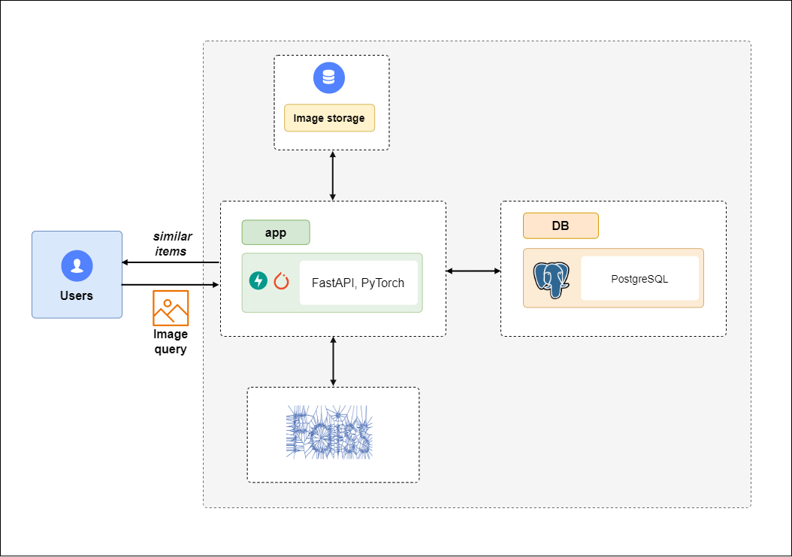

# 🔍 Поиск товаров по фотографии (CBIR)

Сервис визуального поиска: по загруженной фотографии находит похожие товары
в каталоге объявлений и возвращает ссылки на них. Content-Based Image Retrieval
на эмбеддингах Vision Transformer. Финальный проект Академии аналитиков Авито.

**Стек:** Python 3.10 · FastAPI · PyTorch · FAISS · PostgreSQL · Docker



Дообученный экстрактор Unicom ViT-B/32 даёт **CMC@8 49%** против 41% у базовой
модели; средняя задержка ответа — **87 мс** на GPU Tesla T4 и 141 мс на CPU.

## Как это работает

1. Пользователь отправляет фото на `POST /find_simular_images`.
2. Экстрактор Unicom ViT-B/32 (PyTorch) считает эмбеддинг размерности 512
   и L2-нормализует его.
3. FAISS `IndexFlatIP` (внутреннее произведение по нормированным векторам =
   косинусная близость) отдаёт top-8 ближайших `image_id`.
4. PostgreSQL возвращает `item_url` и `title` для найденных id.
5. Сервис отдаёт HTML с превью восьми товаров и ссылками на объявления.

Модель загружается один раз при старте, FAISS-индекс держится в памяти процесса.

## Результаты

Сравнение предобученных экстракторов и дообученной модели на валидации
(метрики Open Metric Learning, leave-one-out по галерее):

| Модель | Размер эмбеддинга | CMC@1 | CMC@8 | MAP@8 |
|---|---:|---:|---:|---:|
| ViT-S/16 Triplet | 384 | 4.3 | 8.3 | 5.3 |
| ViT-B/8 DINO | 768 | 12.2 | 27.4 | 16.2 |
| CLIP ViT-B/16 | 512 | 15.2 | 36.7 | 20.8 |
| Unicom ViT-B/32 | 512 | 19.7 | 41.0 | 25.2 |
| Unicom ViT-L/14 | 768 | 26.8 | 51.6 | 33.0 |
| **Unicom ViT-B/32 + fine-tuning** | 512 | **25.3** | **49.0** | **35.1** |

В прод отправлен дообученный Unicom ViT-B/32: по MAP@8 он не уступает более
тяжёлому ViT-L/14 (35.1 против 33.0) при меньшем эмбеддинге (512 против 768).

**Как считалось.** Валидация — 5% labels (~1.5 тыс. labels / ~5 тыс.
изображений после чистки), метрики — `cmc@k`, `precision@k`, `map@k` из
`oml.metrics.EmbeddingMetrics`.

**Ограничения оценки.** Это валидационные метрики. Дообученная строка отобрана
по лучшему `CMC@8` на той же валидации (сохранялся лучший чекпоинт за 20 эпох),
поэтому её стоит читать как верхнюю оценку — отдельный held-out test не
выделялся. Строки предобученных моделей несмещённые: на валидации ничего не
обучалось и не отбиралось.

### Нагрузочное тестирование

Случайные изображения в течение минуты на `/find_simular_images`, сервер
Intel Xeon + Tesla T4 16 ГБ ([demo/demo_load.py](demo/demo_load.py)):

| Устройство | Запросов | Средний ответ | p95 | RPS |
|---|---:|---:|---:|---:|
| GPU (Tesla T4) | 685 | 87 мс | 115 мс | 11.4 |
| CPU (Xeon) | 423 | 141 мс | 203 мс | 7.0 |

## Установка и запуск

Нужен Docker и Docker Compose. Веса модели скачиваются автоматически с
Яндекс.Диска при первом старте (ссылка — `MODEL_URL`). Для офлайн-наполнения
каталога дополнительно нужен Python 3.10.

Переменные окружения:

| Переменная | Назначение | По умолчанию |
|---|---|---|
| `HOSTNAME` | хост PostgreSQL | `localhost` (в Compose — `postgres`) |
| `MODEL_URL` | публичная ссылка Яндекс.Диска на веса | ссылка в [lib/settings.py](lib/settings.py) |

Учётные данные PostgreSQL (`postgres` / `postgres`, БД `db`) заданы в
[lib/settings.py](lib/settings.py).

### Запуск сервиса

```bash
docker-compose -f docker-compose.yml up --build -d
```

Сервис поднимается на `http://localhost` (порт 80 → 8000 в контейнере).
На главной странице — форма загрузки изображения.

Остановка:

```bash
docker-compose -f docker-compose.yml down --remove-orphans
```

### Наполнение каталога

Поиск возвращает результаты после того, как в базу загружен каталог.

1. Положить в `data/` файл `avito_images.csv` с колонками `image_id`,
   `title`, `item_url` и изображения каталога в `data/images/{image_id}.jpg`.
2. Построить базу и индекс:

```bash
cd load_artifacts && python start.py
```

Скрипт считает эмбеддинги всех изображений, пишет их в PostgreSQL и собирает
FAISS-индекс. [load_artifacts/setup.sh](load_artifacts/setup.sh) автоматизирует
этот путь из готовых артефактов на Яндекс.Диске (блоки скачивания данных нужно
раскомментировать под своё окружение).

> При смене метрики/модели пересоберите FAISS-индекс скриптом выше — старый
> индекс на диске не пересчитывается автоматически.

## API

| Метод | Путь | Описание |
|---|---|---|
| `GET` | `/` | веб-страница с формой загрузки |
| `POST` | `/find_simular_images` | поиск похожих; поле `image` (jpg/png/jpeg), ответ — HTML с top-8 |

```bash
curl -X POST http://localhost/find_simular_images \
  -F "image=@tests/query_image_test.jpg"
```

Готовая коллекция запросов — [FastAPI.postman_collection.json](FastAPI.postman_collection.json).

## Данные и обучение

Датасет собран по контактам байеров за один день: 200 тыс. объявлений и
1.2 млн изображений. Один `label` проставлен всем товарам одного байера внутри
категории; для каждого товара берётся титульная фотография. После разметки —
47 тыс. labels / 137 тыс. изображений, в среднем 3 объявления на label.

Дообучение базового Unicom ViT-B/32
([experiments/models.ipynb](experiments/models.ipynb)):

- лосс — `TripletLossWithMiner` (margin 0.1) с `HardTripletsMiner`;
- сэмплер — `CategoryBalanceSampler` (10 labels × 8 instances);
- оптимизатор — Adam, lr 1e-6, 20 эпох, seed 60;
- отбор чекпоинта — по лучшему `CMC@8` на валидации.

## Структура проекта

```
lib/                  FastAPI-сервис
  app.py              эндпоинты, загрузка модели и индекса при старте
  model.py            экстрактор эмбеддингов и трансформы
  faiss_search.py     построение FAISS-индекса и поиск
  db.py               работа с PostgreSQL (пул соединений)
  html_builder.py     сборка ответа
  utils.py            загрузка весов, чтение изображений
  settings.py         конфигурация
load_artifacts/       офлайн-наполнение базы и индекса
experiments/          бенчмарк моделей и дообучение (ноутбук)
demo/                 нагрузочное тестирование
tests/                pytest-набор
```

## Разработка и тесты

Тесты требуют PostgreSQL и запускаются в контейнере:

```bash
docker-compose -f docker-compose-test.yml up --build --abort-on-container-exit
```

Линтер и форматтер — [ruff](https://docs.astral.sh/ruff/):

```bash
ruff check .
ruff format .
```

## Ограничения

- `CMC@1 ≈ 25%` — точное первое попадание умеренное; каталог реальных
  объявлений с разнородной одеждой сложен для точного матчинга.
- `IndexFlatIP` — точный перебор, подходит для каталога такого масштаба
  (~137 тыс.). Для больших объёмов нужен приближённый индекс (IVF, HNSW).
- Веса грузятся как полный сериализованный объект PyTorch, учётные данные БД
  заданы в коде — для публичного деплоя это стоит вынести в секреты.

---

Команда **Triplet A** — Слесаренко Анастасия. Учебный проект Академии
аналитиков Авито.
